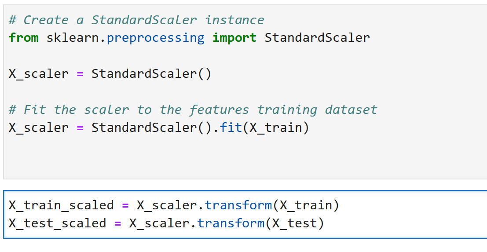

# Neural Networks for analyzing and predicting financial performance

## Purpose
We analyze funding and risks with Neural Networks by creating binary classification models and arrive to predictions. 
Nerural networks

### Data set used for analysis

    applicants_data.csv
  
- This data set consists of 34000 organizations that have recieved funding over the years. The main feature includes if each business was successful or not. The success feature will be determined make predictions that will be used to decide if a bank will lend or not. Thus establishin some risk metric based on predicitive supervised machine learning  

### Best Methods and Approach:
1. Import data from Path and complete basic analysis.
2. Fit for Neural Network models
3. Use Neural Network modeling techniques: Binary Classification
4. Optimize model with Tensorflow and Keras.
5. Use other 2 deep neural network models and 2 optimization scenarios
6. Complete predictions for each model
7. Compute the accuracy of each model

### Summary of Analysis:
1. Save predicted files formated as HDF5
2. Name files as AlphabetSoup.h5 (data for model is formated as hdf5)
3. Evaluate each model and its accuracy
File includes the initial model's data

    
---
## Technologies
### Python:

    Phyton Version: **3.7.13**

## Libraries and Dependencies

### Sklearn
[sklearn](https://scikit-learn.org/stable/)

### Standard Scaler
[standardscaler](https://scikit-learn.org/stable/modules/generated/sklearn.preprocessing.StandardScaler.html)

### Binary Crossentropy
[binary-crosscentropy](https://pythonguides.com/binary-cross-entropy-tensorflow/) 

### Adam optimizer
[adam-optimizer](https://pythonguides.com/adam-optimizer-pytorch/)

### Accuracy Evaluation Metric
[accuracy-evaluation](https://pythonguides.com/adam-optimizer-pytorch/)

---
## How to run
1. Download and install supervised learning libraries
            pip install tensorflow
2. Import required libraries
            import tensorflow as tf
            from tensorflow.keras.layers import Dense
            from tensorflow.keras.models import Sequential
            from sklearn.model_selection import train_test_split
            from sklearn.preprocessing import StandardScaler,OneHotEncoder

3. Run the file with Jupyter notebook or Google Colab

## Use case and Demo 

### Applicant Data

### Standard Scaler:

### Predicted Model and Summary:

### Analysis of Alternarive models

---
## Contributors
Starter code provided by UW FinTech Bootcamp program

---
## License
Tool is available under an MIT License.

---
<!--Aknowledgements -->
## Aknowledgements
* [Markdown Guide](https://www.markdownguide.org/basic-syntax/#reference-style-links)

<!-- MARKDOWN LINKS & IMAGES -->
<!-- https://www.markdownguide.org/basic-syntax/#reference-style-links -->
